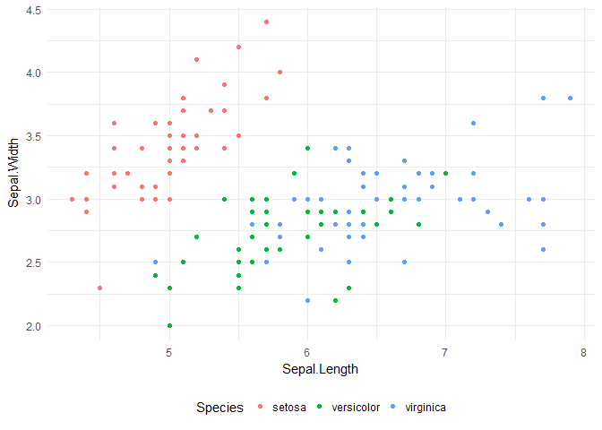

Testowy RMarkdown
================
Wojciech Supko
4 lutego 2018

Load neccessary libraries
-------------------------

``` r
library(data.table)
library(ggplot2)
```

Data manipulation
-----------------

``` r
tmp <- data.table(iris)

ggplot(tmp) + geom_point(aes(x = Sepal.Length, y = Sepal.Width, col = Species)) + 
    theme_minimal() +
    theme(legend.position =  'bottom')
```


